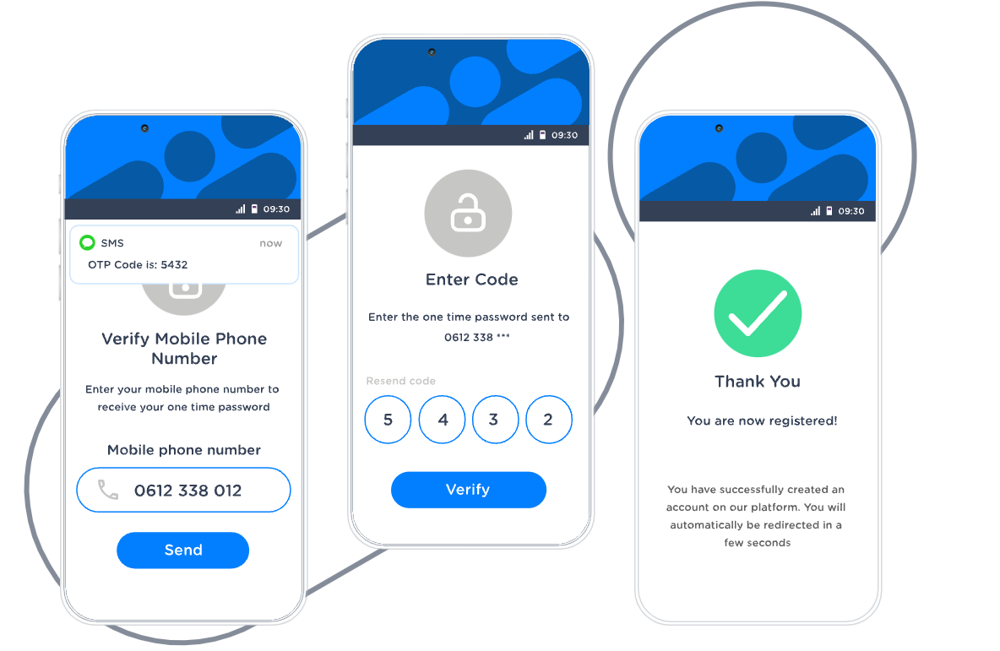

# TDD Practise For OTP(one time password)



一次性验证码如短信验证是我们在日常生活中最常见的情景了，不管是新用户注册验证手机号，还是手机号码一键登录等，均需要进行一次性验证。

之所以称之为一次性验证是因为该密码是动态生成的，只能验证一次，验证成功之后就不能被再次验证。

该需求涉及到使用第三方API发送验证码，使用Redis一次性验证码的存储，提供API测试接口等，全程我们将使用TDD的方式来开发，相信你学完之后大有裨益。

## 你需要具备什么？

由于此次课程属于TDD的中高级课程，所以你需要具备以下技能才能完整的学习：

* TDD基础知识
* Java基本技能
* Spring Boot/Redis/Mockito等基础知识

## 业务需求

验证码的发送和验证基本是两个过程：发送OTP阶段和验证OTP的有效性两个阶段，下面就以注册用户时验证手机号码合法性为例，提供其详细的AC。

### 发送OTP阶段

**AC1**：当国内(特指中国)用户输入正确的手机号码时，点击发送按钮，用户在等待几秒钟之后，手机会接收到长度为6位数字的验证码, 如下：
```bash
[OTP] 亲爱的用户，您的一次性验证码为03465。
```

**AC2**：当国内(特指中国)用户在60S内给相同的手机号码发送验证码时，系统将提示用户错误消息：
```bash
不能连续发送验证码，请在60秒之后重试。
```

**AC3**：当国内(特指中国)用户在60S ~ 15min内发生如下情况，可以给此手机重新发送验证码，验证码的消息与AC1一致。
* 用户接收到验证码但没有验证过
* 用户不小心将刚收到的验证码删除
* 由于网络通信原因，用户没有收到验证码

**AC4**：当国内(特指中国)用户在接收到验证码之后15min内未完成验证时，点击发送按钮，用户手机将会接收到一个全新的验证码，验证码的消息与AC1一致。

**AC5**：当国内(特指中国)用户输入非法的手机号时，系统将提示用户错误消息。
* 手机号是境外号， 错误消息为：`手机号输入有误，请重新输入`
* 手机号小于11位，错误消息为： `手机号输入有误，请重新输入`
* 手机号里面包含非数字，错误消息为： `手机号输入有误，请重新输入`
* 其他错误情况，错误消息为： `手机号输入有误，请重新输入`

### 验证OTP阶段

**AC1**：当用户将接受到的验证码正确输入到验证框中之后，点击验证按钮，系统将验证成功，提示如下消息：
```bash
验证成功
```

**AC2**：当用户输入异常的验证码时，点击验证按钮，系统将验证失败，提示如下错误消息：
```bash
验证码有误，验证失败，请重新获取验证码再次验证！
```
异常的验证码包括：
* 验证码小于6位的数字
* 验证码包含非法的字符
* 错误的验证码
* 错误的手机号
* 手机号包含非法字符
* 其他情况

**AC3**：当用户给手机发送验证码之后，15min之后去验证，系统系统如下错误消息：
```bash
验证码已经过时，请重新获取验证码再次验证！
```

**AC4**：当用户使用验证码验证成功之后，再次使用旧验证码或错误验证码验证时，系统将提示如下消息：
```bash
此手机号已经被验证成功，无需再次验证！
```